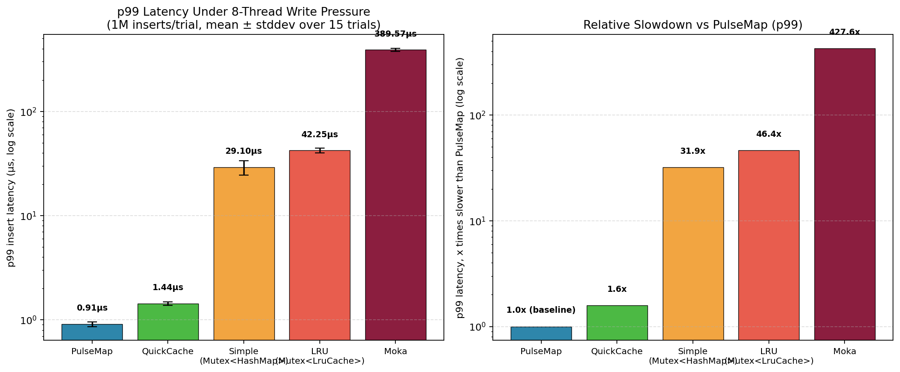

# PulseMap

A fixed-capacity hash table with built-in LFU+LRU eviction, written in Rust.

[](https://crates.io/crates/pulse_map)
[](LICENSE)
[]()

---

## What Is PulseMap?

PulseMap is a **hash table with built-in eviction** — not a HashMap replacement.

Use **HashMap** when you need to store all data indefinitely.
Use **PulseMap** when you need a **fixed-memory cache** that automatically evicts cold entries.

```
HashMap  → stores everything, memory grows unbounded
PulseMap → stores hot data, fixed capacity, cold entries evicted automatically
```

The closest comparison in the Rust ecosystem is the [`lru`](https://crates.io/crates/lru) crate.

---

## Why PulseMap?

| Problem | `HashMap + LRU list` | PulseMap |
|---------|---------------------|----------|
| Two structures to manage | HashMap + linked list | Single structure |
| Eviction needs extra fetches | 2–3 pointer chases per eviction | Metadata is in the same bucket |
| Memory per entry (measured, 1M capacity, RSS) | 67.7B (`lru` crate) | **25.6B** |
| Cache alignment | Random pointer chasing | 64-byte aligned bucket |

> Slot payload itself is 14 bytes — the 25.6B/entry above is the real
> measured cost including bucket/hash-table overhead at scale. See
> [Memory Footprint](#memory-footprint-measured) for full numbers and methodology.

---

## Quick Start

### Raw API (`&[u8]` — maximum control)

```rust
use pulse_map::PulseMap;

let mut map = PulseMap::new(1024); // 1024 buckets × 4 slots = 4096 capacity
map.insert(b"hello", b"world");
assert_eq!(map.get(b"hello"), Some(&b"world"[..]));
map.remove(b"hello");
assert_eq!(map.get(b"hello"), None);
```

### Typed API (recommended)

```rust
use pulse_map::TypedPulseMap;

let mut map = TypedPulseMap::<u32, u64>::new(256);
map.insert(42, 100);
assert_eq!(map.get(&42), Some(100));

// Iterate
for (key, value) in map.iter() {
    println!("{}: {}", key, value);
}

// Bulk insert
map.extend(vec![(1, 10), (2, 20), (3, 30)]);

// From std::HashMap
use std::collections::HashMap;
let std_map: HashMap<u32, u32> = HashMap::from([(1, 10), (2, 20)]);
let pulse = TypedPulseMap::from(std_map);

// Stats
println!("{}", map); // PulseMap(4/1024 entries, 0.4% load, 0 evictions)
```

### Concurrent API (thread-safe)

```rust
use pulse_map::ConcurrentPulseMap;
use std::sync::Arc;
use std::thread;

let map = Arc::new(ConcurrentPulseMap::<u32, u32>::new(1024));

// All methods take &self — safe to share across threads without Mutex
let handles: Vec<_> = (0..4).map(|t| {
    let m = map.clone();
    thread::spawn(move || {
        for i in 0..1000 {
            m.insert(t * 1000 + i, i);
        }
    })
}).collect();
for h in handles { h.join().unwrap(); }

// Auto-resize mode
let growing_map = ConcurrentPulseMap::<u32, u32>::with_auto_resize(64);
// Map auto-grows when load > 75%
```

### ShardedPulseMap (16-shard, no global lock) — v0.6.1+

```rust
use pulse_map::ShardedPulseMap;
use std::sync::Arc;
use std::thread;

// 16 independent shards — near-zero cross-thread contention
let map = Arc::new(ShardedPulseMap::<u32, u32>::new(4096)); // 4096 buckets/shard

let handles: Vec<_> = (0..8).map(|t| {
    let m = map.clone();
    thread::spawn(move || {
        for i in 0..10_000 {
            m.insert(t * 10_000 + i, i);
        }
    })
}).collect();
for h in handles { h.join().unwrap(); }

// resize_all() rehashes one shard at a time — no stop-the-world
map.resize_all(8192);
```

### TTL — Automatic Expiry (v0.6.0+)

```rust
use pulse_map::PulseMap;

let mut cache = PulseMap::new(1024);

// Entries expire after 500 insertions
cache.set_ttl(500);

cache.insert(b"session:abc", b"user_data");

// ...500+ inserts later...
for i in 0u32..501 {
    cache.insert(&i.to_le_bytes(), b"other");
}

assert_eq!(cache.get(b"session:abc"), None); // expired

// Re-inserting refreshes the epoch
cache.insert(b"session:abc", b"refreshed");
assert_eq!(cache.get(b"session:abc"), Some(&b"refreshed"[..]));

println!("TTL: {} epochs", cache.get_ttl());     // 500
println!("Epoch: {}", cache.current_epoch());    // total inserts
```

> TTL is measured in insertion count, not wall-clock time.
> `set_ttl(0)` disables TTL (default — zero overhead).

### Per-Entry TTL (v0.6.1+)

```rust
use pulse_map::PulseMap;

let mut cache = PulseMap::new(1024);
cache.set_ttl(500); // default: 500 inserts

// Per-entry override
cache.insert_ttl(b"session", b"data", 50);      // this entry: 50 inserts
cache.insert_ttl(b"config", b"val", u32::MAX);  // this entry: never expires
cache.insert(b"normal", b"val");                // uses default TTL = 500
```

> `ttl = 0`: use global default. `u32::MAX`: never expire. `N`: expire after N inserts.

### Supported Types

Built-in `PulseKey`/`PulseValue` implementations (zero heap allocation for numeric types):

`u8` · `u16` · `u32` · `u64` · `i32` · `i64` · `String` · `Vec<u8>` · `[u8; N]` · `bool`

Implement `PulseKey` / `PulseValue` for custom types.

---

## Benchmark Results (v0.6.1)

Criterion results on Dell Latitude 7490. Your numbers will vary by hardware.

### Single-Thread (100K ops)

| Benchmark | PulseMap | `lru` | `quick_cache` | `moka` |
|-----------|:-------:|:-----:|:-------------:|:------:|
| **INSERT** | **6.1 ms** | 19.1 ms | 5.6 ms | 161 ms |
| **LOOKUP** | 5.4 ms | 5.4 ms | **2.8 ms** | 40 ms |
| **MIXED** | 10.9 ms | 23.7 ms | **8.4 ms** | 187 ms |
| **EVICTION (50K)** | **1.9 ms** 🥇 | 2.3 ms | 3.3 ms | 55.5 ms |

**Where PulseMap wins:** Eviction-heavy workloads (1.7x faster than quick_cache, 29x faster than moka). This is PulseMap's core strength — metadata lives in the same cache line as data.

**Where PulseMap loses:** Pure lookup is ~1.9x behind quick_cache (serialization overhead for `no_std`/FFI compatibility).

### Multi-Thread — 4 Threads, 100K ops

| Benchmark | ShardedPulseMap | ConcurrentPulseMap | `moka` |
|-----------|:--------------:|:-----------------:|:------:|
| **4T INSERT** | **8.8 ms** 🥇 | 20.2 ms | 104 ms |
| **4T LOOKUP** | **9.0 ms** 🥇 | 35.0 ms | 21.1 ms |
| **4T MIXED** | **15.9 ms** 🥇 | 46.6 ms | 197 ms |

ShardedPulseMap: **2.3x faster** than ConcurrentPulseMap, **6.5-12x faster** than moka on concurrent workloads.

### vs std::HashMap (different category — reference only)

| Benchmark (100K ops) | PulseMap | std::HashMap | Note |
|---------------------|:-------:|:------------:|:----:|
| INSERT | 6.1 ms | 2.5 ms | std has no eviction |
| LOOKUP | 5.4 ms | 2.9 ms | std uses SIMD + native types |
| EVICTION | **1.9 ms** | not possible | — |

---

## Write-Pressure Benchmark: Multi-Threaded, Statistical (8 threads, 1M inserts)

The Criterion numbers above are single-threaded. The results below test what
actually causes production latency spikes: **8 threads inserting concurrently**
into a full cache, forcing continuous eviction under real contention.

**Methodology** (chosen to survive scrutiny, not just look good):
- 8 writer threads, synchronized start via `Barrier`, 1,000,000 total inserts per trial
- **15 independent trials**, fresh cache instance each trial — results below are **mean ± stddev**, not a single lucky run
- Moka configured with `initial_capacity` set, so table-resize cost isn't mixed into "eviction" cost
- p99 (not max) is the primary metric — a single max sample is dominated by OS scheduler noise, not the cache's own behavior. Max is reported for reference only.

| Cache | p50 | p99 (mean ± stddev) | max (mean ± stddev, high variance — reference only) |
|---|:-:|:-:|:-:|
| **PulseMap** | **323ns** | **911ns ± 46ns** | 5.85ms ± 1.69ms |
| QuickCache | 350ns | 1.437µs ± 54ns | 2.03ms ± 1.26ms |
| Simple (`Mutex<HashMap>`) | 564ns | 29.10µs ± 4.58µs | 22.52ms ± 4.54ms |
| LRU (`Mutex<LruCache>`) | 2.415µs | 42.25µs ± 2.32µs | 4.43ms ± 1.13ms |
| Moka | 902ns | 389.57µs ± 13.53µs | 13.34ms ± 2.04ms |



**Head-to-head verdicts** (is the gap bigger than the trial-to-trial noise, or just a fluke?):

| Comparison | p99 gap | Combined stddev | Verdict |
|---|:-:|:-:|---|
| PulseMap vs Moka | 388.66µs | 13.58µs | PulseMap reliably lower — **427.6x** |
| PulseMap vs LRU | 41.34µs | 2.36µs | PulseMap reliably lower — **46.4x** |
| PulseMap vs Simple | 28.19µs | 4.63µs | PulseMap reliably lower — **31.9x** |
| PulseMap vs QuickCache | 526ns | 99ns | PulseMap reliably lower — **1.6x** (real, but the closest margin of the four) |

**Honest read of these numbers:**
- Against Moka, the gap is enormous and not close — this is where a background-eviction-thread design under queue backpressure really costs you.
- Against a naive `Mutex<HashMap>` and a `Mutex`-wrapped `lru::LruCache`, PulseMap wins by a wide margin because both serialize all writers behind one lock; PulseMap and QuickCache don't.
- Against **QuickCache** — also a lock-free, inline-eviction design — the margin is real (5.3x the combined noise) but modest at 1.6x. Both designs are in the same tier; treat this as "PulseMap is consistently a bit faster here," not "QuickCache is a bad cache."
- `max` numbers have high stddev across *every* cache tested (a single unlucky scheduler preemption can hit anyone), which is why p99 — not max — is the metric to trust for comparing tail latency.

Full benchmark source (multi-threaded, statistical harness) is in `examples/`.

---

## Memory Footprint (Measured)

Real RSS memory, not theoretical struct sizes. Each `(cache, capacity)` pair
was measured in its own **fresh child process** (no allocator-arena reuse
between tests), both **empty** (right after `new(capacity)`) and **filled**
to 100% capacity — Linux uses lazy page commit, so an allocation that's
never written to won't show up in RSS even if it was "reserved."

| Cache | Capacity | Empty RSS | Filled RSS | Bytes/entry |
|---|:-:|:-:|:-:|:-:|
| **PulseMap** | 100K | 3.16MB | 3.12MB | 32.7B |
| **PulseMap** | 500K | 12.30MB | 12.30MB | 25.8B |
| **PulseMap** | 1M | 24.42MB | 24.41MB | **25.6B** |
| QuickCache | 100K | 0.22MB | 3.90MB | 40.9B |
| QuickCache | 500K | 0.22MB | 17.83MB | 37.4B |
| QuickCache | 1M | 0.22MB | 34.35MB | 36.0B |
| LRU (`lru` crate) | 100K | 0.25MB | 5.28MB | 55.4B |
| LRU (`lru` crate) | 500K | 1.14MB | 32.37MB | 67.9B |
| LRU (`lru` crate) | 1M | 2.12MB | 64.55MB | 67.7B |
| Moka | 100K | 2.29MB | 29.79MB | 312.3B |
| Moka | 500K | 8.53MB | 145.88MB | 305.9B |
| Moka | 1M | 16.53MB | 291.12MB | 305.3B |
| `std::HashMap` (no eviction, reference only) | 1M | 2.20MB | 18.11MB | 19.0B |

**What this shows:**
- At 1M capacity, PulseMap uses **29% less memory per entry than QuickCache**, **62% less than `lru`**, and **91% less than Moka**.
- PulseMap's empty and filled RSS are nearly identical (24.42MB → 24.41MB) — memory is committed at `new()` and stays flat. Every other cache tested grows lazily as you insert. If predictable, front-loaded memory is a requirement (embedded, containers with tight memory limits), this is the practically relevant number, not just the average bytes/entry.
- `std::HashMap`'s 19.0B/entry is lower than PulseMap's, but it's not a fair comparison — it has no eviction, no fixed capacity, and no priority tracking; it's included only as a reference point for "what raw storage with none of PulseMap's features would cost."

---

## Eviction Quality (Hit Rate, Not Speed)

Speed alone doesn't prove an eviction policy is smart — it could just be
evicting fast and wrong. This measures hit rate under memory pressure:
capacity fixed at 10% of the key space, Zipfian-distributed access
(exponent 1.3, a realistic hot/cold pattern), single-threaded so
lock-contention noise doesn't muddy the comparison between policies. Each
cache saw the identical access sequence per trial; 5 seeded trials, mean ±
stddev reported.

Tested across three read/write ratios (80/20, 99/1, and 100%
cache-fill-on-miss) to confirm the result holds regardless of workload
shape:

| Cache | Hit Rate (mean ± stddev, consistent across all ratios tested) |
|---|:-:|
| **PulseMap** | **96.73% ± 0.01%** |
| QuickCache | 96.49% ± 0.01% |
| Moka | 96.40–96.45% ± 0.01% |
| LRU (`lru` crate) | 95.83% ± 0.01% |

PulseMap's LFU+LRU hybrid produced the highest hit rate of all four caches
tested, beating Moka's TinyLFU by ~0.3 points and plain LRU by ~0.9 points.
The gaps are small in absolute terms but far larger than the run-to-run
noise (stddev ≈ 0.01%), and the ranking was stable across every read/write
ratio tested — this isn't a workload-shape artifact.

---

## Where PulseMap Fits

Beyond raw insert throughput, three production-shaped workloads were tested
head-to-head against Moka, QuickCache, `lru`, and a naive `Mutex<HashMap>`:
(A) an 80/20 read/write mix with Zipfian hot keys — the shape of most real
caches (DNS, session stores, API caches); (B) large-scale sustained inserts
with heavy eviction; and (C) extreme contention, where many threads hammer
a tiny keyspace of just 64 keys (a "hot partition" — a viral user, a
trending API route).

| Scenario | Winner | Notes |
|---|---|---|
| A — Realistic mixed workload (hot-key 80/20) | QuickCache | ~2.8x lower p99 than PulseMap on GET; both hit similar ~91-92% cache hit rates |
| B — Large-scale sustained inserts | QuickCache | Modestly higher throughput than PulseMap; Moka is ~20x slower here |
| C — Extreme hot-key contention (64 keys, 8 threads) | **PulseMap** | 2.7x lower p99 than QuickCache, and far more *consistent* — QuickCache's stddev was 20x higher, meaning its tail latency got unpredictable under contention while PulseMap's didn't |
| D — Eviction quality (hit rate under memory pressure) | **PulseMap** | Highest hit rate of all 4 caches (96.73%), consistent across every read/write ratio tested — see [Eviction Quality](#eviction-quality-hit-rate-not-speed) |
| Memory footprint at scale | **PulseMap** | 29% less per-entry memory than QuickCache, with flat (non-growing) allocation |

**Practical read:** for general-purpose low-contention caching, QuickCache
is a strong, slightly faster choice. **PulseMap's specific advantage shows
up under contention** — many threads repeatedly touching a small, hot set
of keys — and in memory-constrained environments where a flat, predictable
allocation matters more than a small latency edge. Rate limiters on popular
IPs, hot session keys, and trending-content caches are the workloads where
PulseMap pulls ahead; generic low-contention application caching is closer
to a coin flip between PulseMap and QuickCache. On top of the latency picture, PulseMap's eviction policy also kept the
right keys hot more often than every alternative tested — so even in the
low-contention case where QuickCache is a bit faster, PulseMap's cache
hit rate was still the highest of the four.

---

## Architecture

```
┌──────────────────────────────────────────────────────────────────┐
│                    ONE BUCKET (64 bytes, cache-line aligned)      │
├──────────────────────────────────────────────────────────────────┤
│  MetaWord (8 bytes)                                              │
│  ┌─────────┬──────────────┬───────────────────────────────────┐  │
│  │ States  │  H2 Finger-  │  Priority Scores                 │  │
│  │ 4×2 bit │  prints 4×7b │  4×7 bit (freq[4] + recency[3]) │  │
│  └─────────┴──────────────┴───────────────────────────────────┘  │
│                                                                  │
│  Slot 0 (14B) │ Slot 1 (14B) │ Slot 2 (14B) │ Slot 3 (14B)     │
│                                                                  │
│  Total: 8 + (4 × 14) = 64 bytes ✓                               │
└──────────────────────────────────────────────────────────────────┘
```

**Slot storage modes:**

```
Inline mode (mode bit = 0) — key ≤ 6B, value ≤ 7B:
  [header][key bytes 1..6][value bytes 7..13]

Slab mode (mode bit = 1) — larger keys or values:
  [header][ext fingerprint][slab index → heap-allocated SlabEntry]
```

### Layered Design

```
Layer 5: sharded.rs → ShardedPulseMap (16 × ConcurrentPulseMap, shard-per-key)
Layer 4: sync.rs    → ConcurrentPulseMap (per-bucket spinlocks + RwLock for resize)
Layer 3: lib.rs     → TypedPulseMap<K,V>, Entry API, PulseKey/PulseValue traits
Layer 2: raw.rs     → PulseMapRaw — insert/get/remove/evict/TTL/per-entry-TTL
Layer 1: engine/    → MetaWord, Slot, Bucket, SlabPool, hash (wyhash)
```

---

## Project Structure

```
pulse_map/
├── Cargo.toml                         # Package manifest
├── src/
│   ├── lib.rs                         # Public API (TypedPulseMap, Entry, traits)
│   ├── raw.rs                         # PulseMapRaw (TTL, per-entry TTL, eviction, slab)
│   ├── sync.rs                        # ConcurrentPulseMap (spinlock + RwLock)
│   ├── sharded.rs                     # ShardedPulseMap (16-shard, no global lock)
│   ├── iter.rs                        # RawIter, TypedIter
│   ├── traits.rs                      # Debug, Display, Extend, From<HashMap>
│   ├── simd.rs                        # SIMD H2 matching (x86_64, optional)
│   └── engine/                        # MetaWord, Slot, Bucket, SlabPool, hash
├── benches/benchmark.rs               # Criterion benchmarks (PulseMap, lru, moka, quick_cache)
├── docs/                              # mdBook documentation
└── examples/                          # basic, concurrent examples
```

---

## API Reference

### PulseMap (raw `&[u8]`)

| Method | Description |
|--------|-------------|
| `PulseMap::new(num_buckets)` | Create with fixed capacity |
| `insert(&mut self, &[u8], &[u8])` | Insert or update (evicts on full bucket) |
| `get(&self, &[u8]) → Option<&[u8]>` | Lookup, updates LFU+LRU priority |
| `peek(&self, &[u8]) → Option<&[u8]>` | Lookup, no priority update |
| `remove(&mut self, &[u8]) → bool` | Delete |
| `set_ttl(u32)` | Expiry in insertion epochs (0 = disabled) |
| `get_ttl() → u32` | Current TTL setting |
| `current_epoch() → u32` | Total insertions |
| `len()`, `capacity()`, `load_factor()`, `eviction_count()` | Stats |

### TypedPulseMap\<K, V\>

| Method | Description |
|--------|-------------|
| `TypedPulseMap::<K,V>::new(n)` | Create typed map |
| `insert(K, V)` | Typed insert |
| `get(&K) → Option<V>` | Typed lookup |
| `peek(&K) → Option<V>` | Lookup, no priority update |
| `contains_key(&K) → bool` | Check existence |
| `remove(&K) → bool` | Delete |
| `entry(K) → Entry` | Entry API (`or_insert`, `and_modify`) |
| `iter() → TypedIter<K,V>` | Iterate all live entries |
| `extend(IntoIterator)` | Bulk insert |
| `From<HashMap<K,V>>` | Convert from std::HashMap |
| `set_ttl(u32)` / `get_ttl()` / `current_epoch()` | TTL |

### ConcurrentPulseMap\<K, V\>

| Method | Description |
|--------|-------------|
| `ConcurrentPulseMap::new(n)` | Fixed-size concurrent map |
| `ConcurrentPulseMap::with_auto_resize(n)` | Auto-grows at 75% load |
| `insert(&self, K, V)` | Thread-safe insert (no `&mut` needed) |
| `get(&self, &K) → Option<V>` | Thread-safe lookup |
| `peek(&self, &K) → Option<V>` | Lookup, no priority update |
| `remove(&self, &K) → bool` | Thread-safe delete |
| `contains_key(&self, &K) → bool` | Check existence |
| `resize(&self, new_size)` | Manual rehash (stop-the-world) |
| `insert_ttl(&self, K, V, u32)` | Thread-safe insert with per-entry TTL |
| `len()`, `capacity()`, `load_factor()` | Stats |

### ShardedPulseMap\<K, V\>

| Method | Description |
|--------|-------------|
| `ShardedPulseMap::new(buckets_per_shard)` | 16-shard concurrent map |
| `ShardedPulseMap::with_auto_resize(n)` | Auto-grows each shard at 75% load |
| `insert(&self, K, V)` | Thread-safe, routed to shard by hash |
| `insert_ttl(&self, K, V, u32)` | Per-entry TTL insert |
| `get(&self, &K) → Option<V>` | Thread-safe lookup |
| `remove(&self, &K) → bool` | Thread-safe delete |
| `resize_all(&self, n)` | Per-shard rehash (no stop-the-world) |
| `set_ttl(u32)` / `get_ttl()` | TTL applied to all shards |
| `len()`, `capacity()`, `load_factor()` | Aggregated stats |

---

## Feature Flags

| Feature | Default | Description |
|---------|:-------:|-------------|
| `std` | ✅ | `ConcurrentPulseMap`, `From<HashMap>`, std traits |
| `simd` | ❌ | SSE2 H2 matching (x86_64 only) |

```toml
# Default
pulse_map = "0.6"

# With SIMD
pulse_map = { version = "0.6", features = ["simd"] }

# no_std (disables ConcurrentPulseMap)
pulse_map = { version = "0.6", default-features = false }
```

> **Note:** `map[&key]` (Index trait) is not implemented. PulseMap returns owned `V` values,
> not references. Use `.get(&key)` instead.

---

## C FFI Bindings (v0.5.0+)

```c
#include "pulse_map.h"
PulseMapHandle *map = pulse_map_new(1024);
pulse_map_insert(map, "hello", 5, "world", 5);
pulse_map_free(map);
```

> Python, Java, and Node.js bindings are available in separate workspace crates.

---

## Use Cases

- **DNS cache** — bounded memory, hot domains stay in
- **API rate limiter** — per-IP counters with automatic cleanup
- **Database query cache** — fixed memory, evicts cold queries
- **Session store** — use TTL to expire old sessions
- **CDN / edge cache** — hot content stays, cold evicted
- **Embedded systems** — predictable memory, no heap growth

---

## Known Limitations

- Lookup is ~1.9x slower than `quick_cache` — serialization trade-off for `no_std`/FFI
- On low-contention, general-purpose read/write mixed workloads, QuickCache is modestly faster (see [Where PulseMap Fits](#where-pulsemap-fits)) — PulseMap's edge is specifically under contention and in memory footprint, not universal
- TTL is insertion-count based, not wall-clock time
- No async API yet

---

## Author

**Deendayal Kumawat**

[](https://www.linkedin.com/in/deendayal-kumawat/)
[](https://github.com/ddsha441981)
[](mailto:deendayal_kumawat@outlook.com)

---

## License

Licensed under either of:

- **Apache License, Version 2.0** — [LICENSE-APACHE](LICENSE-APACHE)
- **MIT License** — [LICENSE-MIT](LICENSE-MIT)

at your option.