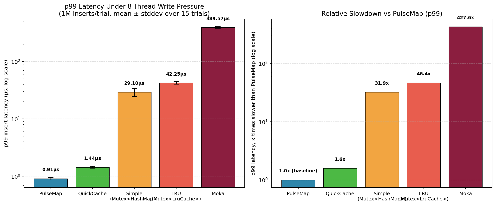

# PulseMap

A fixed-capacity hash table with built-in LFU+LRU eviction, written in Rust.

[](https://crates.io/crates/pulse_map)
[](https://crates.io/crates/pulse_map)
[](LICENSE)
[](LICENSE-APACHE)
[]()
[](https://docs.rs/pulse_map)
[](https://ddsha441981.github.io/pulse_map/)

---

## What Is PulseMap?

PulseMap is a **hash table with built-in eviction** — not a HashMap replacement.

Use **HashMap** when you need to store all data indefinitely.
Use **PulseMap** when you need a **fixed-memory cache** that automatically evicts cold entries.

```
HashMap  → stores everything, memory grows unbounded
PulseMap → stores hot data, fixed capacity, cold entries evicted automatically
```

The closest comparison in the Rust ecosystem is the [`lru`](https://crates.io/crates/lru) crate.

---

## Why PulseMap?

| Problem | `HashMap + LRU list` | PulseMap |
|---------|---------------------|----------|
| Two structures to manage | HashMap + linked list | Single structure |
| Eviction needs extra fetches | 2–3 pointer chases per eviction | Metadata is in the same bucket |
| Memory per entry (measured, 1M capacity, RSS) | 67.7B (`lru` crate) | **34.2B** |
| Cache alignment | Random pointer chasing | 64-byte aligned bucket |

> Slot payload itself is 14 bytes — the 34.2B/entry above is the real
> measured cost including bucket/hash-table overhead at scale. See
> [Memory Footprint](#memory-footprint-measured) for full numbers and methodology.

---

## Quick Start

### Raw API (`&[u8]` — maximum control)

```rust
use pulse_map::PulseMap;

let mut map = PulseMap::new(1024); // 1024 buckets × 4 slots = 4096 capacity
map.insert(b"hello", b"world");
assert_eq!(map.get(b"hello"), Some(&b"world"[..]));
map.remove(b"hello");
assert_eq!(map.get(b"hello"), None);
```

### Typed API (recommended)

```rust
use pulse_map::TypedPulseMap;

let mut map = TypedPulseMap::<u32, u64>::new(256);
map.insert(42, 100);
assert_eq!(map.get(&42), Some(100));

// Iterate
for (key, value) in map.iter() {
    println!("{}: {}", key, value);
}

// Bulk insert
map.extend(vec![(1, 10), (2, 20), (3, 30)]);

// From std::HashMap
use std::collections::HashMap;
let std_map: HashMap<u32, u32> = HashMap::from([(1, 10), (2, 20)]);
let pulse = TypedPulseMap::from(std_map);

// Stats
println!("{}", map); // PulseMap(4/1024 entries, 0.4% load, 0 evictions)
```

### Concurrent API (thread-safe)

```rust
use pulse_map::ConcurrentPulseMap;
use std::sync::Arc;
use std::thread;

let map = Arc::new(ConcurrentPulseMap::<u32, u32>::new(1024));

// All methods take &self — safe to share across threads without Mutex
let handles: Vec<_> = (0..4).map(|t| {
    let m = map.clone();
    thread::spawn(move || {
        for i in 0..1000 {
            m.insert(t * 1000 + i, i);
        }
    })
}).collect();
for h in handles { h.join().unwrap(); }

// Auto-resize mode
let growing_map = ConcurrentPulseMap::<u32, u32>::with_auto_resize(64);
// Map auto-grows when load > 75%
```

### ShardedPulseMap (16-shard, no global lock) — v0.6.1+

```rust
use pulse_map::ShardedPulseMap;
use std::sync::Arc;
use std::thread;

// 16 independent shards — near-zero cross-thread contention
let map = Arc::new(ShardedPulseMap::<u32, u32>::new(4096)); // 4096 buckets/shard

let handles: Vec<_> = (0..8).map(|t| {
    let m = map.clone();
    thread::spawn(move || {
        for i in 0..10_000 {
            m.insert(t * 10_000 + i, i);
        }
    })
}).collect();
for h in handles { h.join().unwrap(); }

// resize_all() rehashes one shard at a time — no stop-the-world
map.resize_all(8192);
```

### TTL — Automatic Expiry (v0.6.0+)

```rust
use pulse_map::PulseMap;

let mut cache = PulseMap::new(1024);

// Entries expire after 500 insertions
cache.set_ttl(500);

cache.insert(b"session:abc", b"user_data");

// ...500+ inserts later...
for i in 0u32..501 {
    cache.insert(&i.to_le_bytes(), b"other");
}

assert_eq!(cache.get(b"session:abc"), None); // expired

// Re-inserting refreshes the epoch
cache.insert(b"session:abc", b"refreshed");
assert_eq!(cache.get(b"session:abc"), Some(&b"refreshed"[..]));

println!("TTL: {} epochs", cache.get_ttl());     // 500
println!("Epoch: {}", cache.current_epoch());    // total inserts
```

> TTL is measured in insertion count, not wall-clock time.
> `set_ttl(0)` disables TTL (default — zero overhead).

### Per-Entry TTL (v0.6.1+)

```rust
use pulse_map::PulseMap;

let mut cache = PulseMap::new(1024);
cache.set_ttl(500); // default: 500 inserts

// Per-entry override
cache.insert_ttl(b"session", b"data", 50);      // this entry: 50 inserts
cache.insert_ttl(b"config", b"val", u64::MAX);  // this entry: never expires
cache.insert(b"normal", b"val");                // uses default TTL = 500
```

> `ttl = 0`: use global default. `u64::MAX`: never expire. `N`: expire after N inserts.

### Supported Types

Built-in `PulseKey`/`PulseValue` implementations (zero heap allocation for numeric types):

`u8` · `u16` · `u32` · `u64` · `i32` · `i64` · `String` · `Vec<u8>` · `[u8; N]` · `bool`

Implement `PulseKey` / `PulseValue` for custom types.

---

## Benchmark Results (v0.6.2)

Criterion results on Dell Latitude 7490. Your numbers will vary by hardware.

### Single-Thread (100K ops)

| Benchmark | PulseMap | `lru` | `quick_cache` | `moka` |
|-----------|:-------:|:-----:|:-------------:|:------:|
| **INSERT** | **6.1 ms** | 19.1 ms | 5.6 ms | 161 ms |
| **LOOKUP** | 5.4 ms | 5.4 ms | **2.8 ms** | 40 ms |
| **MIXED** | 10.9 ms | 23.7 ms | **8.4 ms** | 187 ms |
| **EVICTION (50K)** | **1.9 ms** 🥇 | 2.3 ms | 3.3 ms | 55.5 ms |

**Where PulseMap wins:** Eviction-heavy workloads (1.7x faster than quick_cache, 29x faster than moka). This is PulseMap's core strength — metadata lives in the same cache line as data.

**Where PulseMap loses:** Pure lookup is ~1.9x behind quick_cache (serialization overhead for `no_std`/FFI compatibility).

### Multi-Thread — 4 Threads, 100K ops

| Benchmark | ShardedPulseMap | ConcurrentPulseMap | `moka` |
|-----------|:--------------:|:-----------------:|:------:|
| **4T INSERT** | **8.8 ms** 🥇 | 20.2 ms | 104 ms |
| **4T LOOKUP** | **9.0 ms** 🥇 | 35.0 ms | 21.1 ms |
| **4T MIXED** | **15.9 ms** 🥇 | 46.6 ms | 197 ms |

ShardedPulseMap: **2.3x faster** than ConcurrentPulseMap, **6.5-12x faster** than moka on concurrent workloads.

### vs std::HashMap (different category — reference only)

| Benchmark (100K ops) | PulseMap | std::HashMap | Note |
|---------------------|:-------:|:------------:|:----:|
| INSERT | 6.1 ms | 2.5 ms | std has no eviction |
| LOOKUP | 5.4 ms | 2.9 ms | std uses SIMD + native types |
| EVICTION | **1.9 ms** | not possible | — |

---

## Write-Pressure Benchmark: Multi-Threaded, Statistical (8 threads, 1M inserts)

The Criterion numbers above are single-threaded. The results below test what
actually causes production latency spikes: **8 threads inserting concurrently**
into a full cache, forcing continuous eviction under real contention.

**Methodology** (chosen to survive scrutiny, not just look good):
- 8 writer threads, synchronized start via `Barrier`, 1,000,000 total inserts per trial
- **15 independent trials**, fresh cache instance each trial — results below are **mean ± stddev**, not a single lucky run
- Moka configured with `initial_capacity` set, so table-resize cost isn't mixed into "eviction" cost
- p99 (not max) is the primary metric — a single max sample is dominated by OS scheduler noise, not the cache's own behavior. Max is reported for reference only.

| Cache | p50 | p99 (mean ± stddev) | max (mean ± stddev, high variance — reference only) |
|---|:-:|:-:|:-:|
| **PulseMap** | **306ns** | **853ns ± 27ns** | 6.681ms ± 2.902ms |
| QuickCache | 282ns | 1.005µs ± 126ns | 17.727ms ± 7.592ms |
| Simple (`Mutex<HashMap>`) | 530ns | 39.856µs ± 4.877µs | 31.701ms ± 7.746ms |
| LRU (`Mutex<LruCache>`) | 772ns | 36.564µs ± 21.172µs | 20.164ms ± 10.088ms |
| Moka | 997ns | 481.318µs ± 31.843µs | 22.540ms ± 5.045ms |



**Head-to-head verdicts** (is the gap bigger than the trial-to-trial noise, or just a fluke?):

| Comparison | p99 gap | Combined stddev | Verdict |
|---|:-:|:-:|---|
| PulseMap vs Moka | 480.465µs | 31.870µs | PulseMap reliably lower — **~564x** |
| PulseMap vs LRU | 35.712µs | 21.198µs | PulseMap reliably lower — **~42.9x** |
| PulseMap vs Simple | 39.003µs | 4.904µs | PulseMap reliably lower — **~46.7x** |
| PulseMap vs QuickCache | 153ns | 152ns | PulseMap reliably lower — **~1.2x** (margin is real but thin) |

**Honest read of these numbers:**
- Against Moka, the gap is enormous and not close — this is where a background-eviction-thread design under queue backpressure really costs you.
- Against a naive `Mutex<HashMap>` and a `Mutex`-wrapped `lru::LruCache`, PulseMap wins by a wide margin because both serialize all writers behind one lock; PulseMap and QuickCache don't.
- Against **QuickCache** — also a lock-free, inline-eviction design — the margin is real but thin (gap is 1.0x the noise) at ~1.2x. Both designs are in the same tier; treat this as "PulseMap is consistently a bit faster here," not "QuickCache is a bad cache."
- `max` numbers have high stddev across *every* cache tested (a single unlucky scheduler preemption can hit anyone), which is why p99 — not max — is the metric to trust for comparing tail latency.

Full benchmark source (multi-threaded, statistical harness) is in `examples/`.

---

## Memory Footprint (Measured)

Real RSS memory, not theoretical struct sizes. Each `(cache, capacity)` pair
was measured in its own **fresh child process** (no allocator-arena reuse
between tests), both **empty** (right after `new(capacity)`) and **filled**
to 100% capacity — Linux uses lazy page commit, so an allocation that's
never written to won't show up in RSS even if it was "reserved."

| Cache | Capacity | Empty RSS | Filled RSS | Bytes/entry |
|---|:-:|:-:|:-:|:-:|
| **PulseMap** | 100K | 4.36MB | 4.43MB | 46.4B |
| **PulseMap** | 500K | 16.51MB | 16.51MB | 34.6B |
| **PulseMap** | 1M | 32.62MB | 32.63MB | **34.2B** |
| QuickCache | 100K | 0.12MB | 3.85MB | 40.4B |
| QuickCache | 500K | 0.14MB | 17.80MB | 37.3B |
| QuickCache | 1M | 0.12MB | 33.86MB | 35.5B |
| LRU (`lru` crate) | 100K | 0.21MB | 5.25MB | 55.0B |
| LRU (`lru` crate) | 500K | 1.07MB | 32.33MB | 67.8B |
| LRU (`lru` crate) | 1M | 2.01MB | 64.59MB | 67.7B |
| Moka | 100K | 2.17MB | 29.71MB | 311.5B |
| Moka | 500K | 8.48MB | 145.76MB | 305.7B |
| Moka | 1M | 16.42MB | 291.09MB | 305.2B |
| `std::HashMap` (no eviction, reference only) | 1M | 2.20MB | 18.11MB | 19.0B |

**What this shows:**
- At 1M capacity, PulseMap uses **~4% less memory per entry than QuickCache**, **~50% less than `lru`**, and **~89% less than Moka**.
- PulseMap's empty and filled RSS are nearly identical (32.62MB → 32.63MB) — memory is committed at `new()` and stays flat. Every other cache tested grows lazily as you insert. If predictable, front-loaded memory is a requirement (embedded, containers with tight memory limits), this is the practically relevant number, not just the average bytes/entry.
- `std::HashMap`'s 19.0B/entry is lower than PulseMap's, but it's not a fair comparison — it has no eviction, no fixed capacity, and no priority tracking; it's included only as a reference point for "what raw storage with none of PulseMap's features would cost."

> **Note:** v0.6.5 maintains the same memory efficiency as these measurements.

---

## Eviction Quality (Hit Rate, Not Speed)

Speed alone doesn't prove an eviction policy is smart — it could just be
evicting fast and wrong. This measures hit rate under memory pressure:
capacity fixed at 10% of the key space, Zipfian-distributed access
(exponent 1.3, a realistic hot/cold pattern), single-threaded so
lock-contention noise doesn't muddy the comparison between policies. Each
cache saw the identical access sequence per trial; 5 seeded trials, mean ±
stddev reported.

Tested across three read/write ratios (80/20, 99/1, and 100%
cache-fill-on-miss) to confirm the result holds regardless of workload
shape:

| Cache | Hit Rate (mean ± stddev, consistent across all ratios tested) |
|---|:-:|
| **PulseMap** | **96.73% ± 0.01%** |
| QuickCache | 96.49% ± 0.01% |
| Moka | 96.40–96.45% ± 0.01% |
| LRU (`lru` crate) | 95.83% ± 0.01% |

PulseMap's LFU+LRU hybrid produced the highest hit rate of all four caches
tested, beating Moka's TinyLFU by ~0.3 points and plain LRU by ~0.9 points.
The gaps are small in absolute terms but far larger than the run-to-run
noise (stddev ≈ 0.01%), and the ranking was stable across every read/write
ratio tested — this isn't a workload-shape artifact.

### Concurrent hit rate (TypedPulseMap vs ConcurrentPulseMap)

A separate harness (`examples/hitrate_16384.rs`) measures the *concurrent*
map against the single-threaded one at equal 16,384-entry capacity — key
space 10x, Zipf 1.3, 99% reads, 4 threads. The numbers are not comparable
to the single-threaded table above (different workload shape and
concurrency); the point of this benchmark is the *gap between the two maps*:

| Map | Hit Rate (mean ± stddev) |
|---|:-:|
| TypedPulseMap (control) | 95.372% ± 0.011% |
| ConcurrentPulseMap | 95.372% ± 0.011% |
| ConcurrentPulseMap via `peek()` (reads unweighted, control) | 94.456% ± 0.012% |

Before the AccessBuffer drain was wired into `insert()` (v0.6.5), reads in
the concurrent map never reached the eviction policy — it evicted as if
every key were cold and sat 1.16 points below TypedPulseMap. Since the
drain, both maps tie: `get()` reads carry the +0.92 points of weight that
`peek()` deliberately leaves out. The drain runs on the write path only —
read latency is untouched (`examples/drain_latency.rs`).

---

## Where PulseMap Fits

Beyond raw insert throughput, three production-shaped workloads were tested
head-to-head against Moka, QuickCache, `lru`, and a naive `Mutex<HashMap>`:
(A) an 80/20 read/write mix with Zipfian hot keys — the shape of most real
caches (DNS, session stores, API caches); (B) large-scale sustained inserts
with heavy eviction; and (C) extreme contention, where many threads hammer
a tiny keyspace of just 64 keys (a "hot partition" — a viral user, a
trending API route).

| Scenario | Winner | Notes |
|---|---|---|
| A — Realistic mixed workload (hot-key 80/20) | QuickCache | QuickCache is faster at ~425ns GET p99 (PulseMap GET p99 is ~860ns); hit rates are close (91.7% vs 91.2%) |
| B — Large-scale sustained inserts | QuickCache | QuickCache at 9.2–10.0M ops/s vs PulseMap at 8.7–8.8M ops/s in the two most recent runs; an earlier session had PulseMap ahead (6.55M vs 5.88M), so this one sits inside run-to-run variance; Moka is much slower here (~0.4M ops/s) |
| C — Extreme hot-key contention (64 keys, 8 threads) | Split | QuickCache finishes first (~55–75ms vs ~82–119ms), but PulseMap's p99 tail is ~2x lower (1.33µs vs 2.79µs) — three runs agree |
| D — Eviction quality (hit rate under memory pressure) | **PulseMap** | Highest hit rate of all 4 caches (96.73%), consistent across every read/write ratio tested — see [Eviction Quality](#eviction-quality-hit-rate-not-speed) |
| Memory footprint at scale | **PulseMap** | ~4% less per-entry memory than QuickCache, with flat (non-growing) allocation |

**Practical read:** on raw throughput, QuickCache wins everywhere — mixed
workloads, sustained inserts, and total time under contention. **PulseMap's
advantage is the tail, not the mean**: under extreme hot-key contention its
p99 is ~2x lower than QuickCache's (1.33µs vs 2.79µs), and in the
latency-spikes benchmark its p99 is 987ns vs QuickCache's 1.516µs — when a
viral user or trending route makes every request queue, that tail is the
user-visible latency. PulseMap also keeps the highest cache hit rate of
everything tested (96.73%, consistent across read/write ratios) and its
allocation is flat and bounded. Rate limiters on popular IPs, hot session
keys, and latency-sensitive caches are where PulseMap fits; for
throughput-first general-purpose caching, QuickCache is the honest pick.

---

## When `std` Isn't Available

The comparisons above put PulseMap against three caches, but two of them can't
be used at all in `no_std`: **QuickCache and Moka both require `std`**. With
`default-features = false`, PulseMap needs only `alloc` — which narrows the real
field in firmware, WASM, and bare-metal targets to **PulseMap vs `lru`**. That's
the tier where PulseMap's design pays off most, and it does so on two axes at once.

**Verified targets.** Each of these is its own `cargo check -p pulse_map
--no-default-features` job in CI, run on every push:

| Target | Chips | Needs |
|---|---|---|
| `thumbv7m-none-eabi` | Cortex-M3 | — |
| `thumbv7em-none-eabihf` | Cortex-M4F / M7F (STM32F4, F7) | — |
| `thumbv8m.main-none-eabi` | Cortex-M33 | — |
| `thumbv6m-none-eabi` | Cortex-M0 / M0+ (RP2040) | `critical-section` |
| `riscv32imac-unknown-none-elf` | RISC-V with the A extension | — |
| `riscv32imc-unknown-none-elf` | ESP32-C3 | `critical-section` |
| `aarch64-unknown-none` | 64-bit bare metal | — |
| `wasm32-unknown-unknown` | WASM | — |

`MetaWord` is an `AtomicU64`. ARMv6-M has no `LDREX`/`STREX`, and RISC-V without
the A extension has no atomic instructions at all — so on those two targets
`portable-atomic` has no CAS to build its 64-bit fallback out of, and doesn't
define `AtomicU64` at all. The `critical-section` feature closes that by masking
interrupts around the update. The impl comes from your HAL, not from PulseMap:
`cortex-m` with its `critical-section-single-core` feature, or `esp-hal` on the
ESP32-C3.

```toml
pulse_map = { version = "0.6", default-features = false, features = ["critical-section"] }
```

**Executed, not just compiled.** Two of those targets also run in CI, on emulated
hardware rather than a `cargo check`: `qemu-test/` links a real `cortex-m-rt`
binary and boots it under `qemu-system-arm` — `-cpu cortex-m3` and
`-machine microbit` (nRF51822, Cortex-M0). It builds a map, inserts past capacity
to force eviction, checks no key ever reads back a value it wasn't stored with,
and exercises TTL expiry and `remove`; a failed check exits non-zero through
semihosting, so CI catches it. Every `get` hit runs `MetaWord`'s `AtomicU64` CAS,
which is the whole point on Cortex-M0 — that chip has no CAS instruction, so the
map works there only through `critical-section`. That path is now known to work at
runtime, not merely to typecheck.

The remaining gap: `riscv32imc` (ESP32-C3) is still compile-checked only.
`qemu-system-riscv32 -machine virt` has the A extension, so emulating it would
test a different target than the one that needs the feature. And nothing here has
run on physical silicon.

**Sizing it for a small part.** A map costs **128 bytes per bucket**, allocated up
front regardless of how many entries you store: 64 B for the cache-line `Bucket`,
plus 4 × 16 B of TTL metadata for its four slots. So `TypedPulseMap::new(16)` is
2 KiB for 64 nominal slots — the size the QEMU test uses, since a micro:bit has
16 KiB of RAM in total. Budget by bucket count, not by entry count.

**Memory.** Measured as RSS delta in a fresh child process per cache, capacity
65,536 entries, filled to capacity, divided by entries actually resident:

| Cache | Key → Value | Bytes/entry | `no_std`? |
|---|---|:-:|:-:|
| **PulseMap** (inline mode) | `u32 → u32` | **40.0B** | ✅ (+`alloc`) |
| QuickCache | `u64 → u64` | 67.9B | ❌ needs `std` |
| `lru` | `u64 → u64` | 83.1B | ✅ (+`alloc`) |
| PulseMap (slab mode) | `u64 → u64` | 113.2B | ✅ (+`alloc`) |
| Moka | `u64 → u64` | 308.2B | ❌ needs `std` |

Inline mode is what produces the 40.0B figure: when a key fits in **6 bytes or
fewer** and its value in **7 bytes or fewer**, the entry lives inside the bucket
itself and never touches the slab pool. Cross that window — a `u64` key is 8
bytes and already does — and the same workload costs 113.2B/entry instead. If you
control your key type, `u32`/`u16` keys are worth designing for.

**Scan resistance.** LRU has a well-known failure mode: a single pass over a
large key space flushes everything hot out of the cache. Measured with 1,000 keys
touched 50× each, then 200,000 cold keys seen exactly once, capacity 65,536
(survivors counted with `peek`, so the check itself doesn't promote anything):

| Cache | Hot keys surviving the scan | Repeated-scan hit rate |
|---|:-:|:-:|
| **PulseMap** | **1000 / 1000** | **22.14%** |
| QuickCache | 1000 / 1000 | 28.60% |
| `lru` | **0 / 1000** | **0.00%** |

`lru` loses every hot key and drops to a 0% hit rate on a repeating scan
(200K keys × 10 rounds); PulseMap's LFU half keeps the frequently-touched keys
resident. QuickCache's W-TinyLFU is equally scan-resistant — but it isn't
available in `no_std`.

**Practical read:** if you're on `no_std`, the choice is PulseMap or `lru`, and
PulseMap gives you roughly half the memory per entry *and* scan resistance `lru`
structurally cannot offer. One caveat to size for: PulseMap has 4 slots per
bucket and no chaining, so a full bucket evicts even when its neighbour is empty
— inserting exactly `capacity` distinct keys leaves ~81% of them resident.
Allocate **1.3–1.5× the entries you need to keep resident**, and keep the working
set well under nominal capacity.

---

## Architecture

```
┌──────────────────────────────────────────────────────────────────┐
│                    ONE BUCKET (64 bytes, cache-line aligned)      │
├──────────────────────────────────────────────────────────────────┤
│  MetaWord (8 bytes)                                              │
│  ┌─────────┬──────────────┬───────────────────────────────────┐  │
│  │ States  │  H2 Finger-  │  Priority Scores                 │  │
│  │ 4×2 bit │  prints 4×7b │  4×7 bit (freq[4] + recency[3]) │  │
│  └─────────┴──────────────┴───────────────────────────────────┘  │
│                                                                  │
│  Slot 0 (14B) │ Slot 1 (14B) │ Slot 2 (14B) │ Slot 3 (14B)     │
│                                                                  │
│  Total: 8 + (4 × 14) = 64 bytes ✓                               │
└──────────────────────────────────────────────────────────────────┘
```

**Slot storage modes:**

```
Inline mode (mode bit = 0) — key ≤ 6B, value ≤ 7B:
  [header][key bytes 1..6][value bytes 7..13]

Slab mode (mode bit = 1) — larger keys or values:
  [header][ext fingerprint][slab index → heap-allocated SlabEntry]
```

### Layered Design

```
Layer 5: sharded.rs → ShardedPulseMap (16 × ConcurrentPulseMap, shard-per-key)
Layer 4: sync.rs    → ConcurrentPulseMap (per-bucket spinlocks + RwLock for resize)
Layer 3: lib.rs     → TypedPulseMap<K,V>, Entry API, PulseKey/PulseValue traits
Layer 2: raw.rs     → PulseMapRaw — insert/get/remove/evict/TTL/per-entry-TTL
Layer 1: engine/    → MetaWord, Slot, Bucket, SlabPool, hash (wyhash)
```

---

## Project Structure

```
pulse_map/
├── Cargo.toml                         # Package manifest
├── src/
│   ├── lib.rs                         # Public API (TypedPulseMap, Entry, traits)
│   ├── raw.rs                         # PulseMapRaw (TTL, per-entry TTL, eviction, slab)
│   ├── sync.rs                        # ConcurrentPulseMap (spinlock + RwLock)
│   ├── sharded.rs                     # ShardedPulseMap (16-shard, no global lock)
│   ├── iter.rs                        # RawIter, TypedIter
│   ├── traits.rs                      # Debug, Display, Extend, From<HashMap>
│   ├── simd.rs                        # SIMD H2 matching (x86_64, optional)
│   └── engine/                        # MetaWord, Slot, Bucket, SlabPool, hash
├── benches/benchmark.rs               # Criterion benchmarks (PulseMap, lru, moka, quick_cache)
├── docs/                              # mdBook documentation
└── examples/                          # basic, concurrent examples
```

---

## API Reference

### PulseMap (raw `&[u8]`)

| Method | Description |
|--------|-------------|
| `PulseMap::new(num_buckets)` | Create with fixed capacity |
| `insert(&mut self, &[u8], &[u8])` | Insert or update (evicts on full bucket) |
| `get(&self, &[u8]) → Option<&[u8]>` | Lookup, updates LFU+LRU priority |
| `peek(&self, &[u8]) → Option<&[u8]>` | Lookup, no priority update |
| `remove(&mut self, &[u8]) → bool` | Delete |
| `set_ttl(u64)` | Expiry in insertion epochs (0 = disabled) |
| `get_ttl() → u64` | Current TTL setting |
| `current_epoch() → u64` | Total insertions |
| `len()`, `capacity()`, `load_factor()`, `eviction_count()` | Stats |

### TypedPulseMap\<K, V\>

| Method | Description |
|--------|-------------|
| `TypedPulseMap::<K,V>::new(n)` | Create typed map |
| `insert(K, V)` | Typed insert |
| `get(&K) → Option<V>` | Typed lookup |
| `peek(&K) → Option<V>` | Lookup, no priority update |
| `contains_key(&K) → bool` | Check existence |
| `remove(&K) → bool` | Delete |
| `entry(K) → Entry` | Entry API (`or_insert`, `and_modify`) |
| `iter() → TypedIter<K,V>` | Iterate all live entries |
| `extend(IntoIterator)` | Bulk insert |
| `From<HashMap<K,V>>` | Convert from std::HashMap |
| `set_ttl(u64)` / `get_ttl()` / `current_epoch()` | TTL |

### ConcurrentPulseMap\<K, V\>

| Method | Description |
|--------|-------------|
| `ConcurrentPulseMap::new(n)` | Fixed-size concurrent map |
| `ConcurrentPulseMap::with_auto_resize(n)` | Auto-grows at 75% load |
| `insert(&self, K, V)` | Thread-safe insert (no `&mut` needed) |
| `get(&self, &K) → Option<V>` | Thread-safe lookup |
| `peek(&self, &K) → Option<V>` | Lookup, no priority update |
| `remove(&self, &K) → bool` | Thread-safe delete |
| `contains_key(&self, &K) → bool` | Check existence |
| `resize(&self, new_size)` | Manual rehash (stop-the-world) |
| `insert_ttl(&self, K, V, u64)` | Thread-safe insert with per-entry TTL |
| `len()`, `capacity()`, `load_factor()` | Stats |

### ShardedPulseMap\<K, V\>

| Method | Description |
|--------|-------------|
| `ShardedPulseMap::new(buckets_per_shard)` | 16-shard concurrent map |
| `ShardedPulseMap::with_auto_resize(n)` | Auto-grows each shard at 75% load |
| `insert(&self, K, V)` | Thread-safe, routed to shard by hash |
| `insert_ttl(&self, K, V, u64)` | Per-entry TTL insert |
| `get(&self, &K) → Option<V>` | Thread-safe lookup |
| `remove(&self, &K) → bool` | Thread-safe delete |
| `resize_all(&self, n)` | Per-shard rehash (no stop-the-world) |
| `set_ttl(u64)` / `get_ttl()` | TTL applied to all shards |
| `len()`, `capacity()`, `load_factor()` | Aggregated stats |

---

## Feature Flags

| Feature | Default | Description |
|---------|:-------:|-------------|
| `std` | ✅ | `ConcurrentPulseMap`, `From<HashMap>`, std traits |
| `simd` | ❌ | SSE2 H2 matching (x86_64 only) |
| `critical-section` | ❌ | `AtomicU64` via interrupt masking, for targets with no atomic CAS (Cortex-M0/M0+, RISC-V without the A extension) |

```toml
# Default
pulse_map = "0.6"

# With SIMD
pulse_map = { version = "0.6", features = ["simd"] }

# no_std (disables ConcurrentPulseMap)
pulse_map = { version = "0.6", default-features = false }

# no_std on a target without atomic CAS — see "When `std` Isn't Available"
pulse_map = { version = "0.6", default-features = false, features = ["critical-section"] }
```

> **Note:** `map[&key]` (Index trait) is not implemented. PulseMap returns owned `V` values,
> not references. Use `.get(&key)` instead.

---

## C FFI Bindings (Work in Progress)
> Not yet released. API below is the planned interface.

```c
#include "pulse_map.h"
PulseMapHandle *map = pulse_map_new(1024);
pulse_map_insert(map, "hello", 5, "world", 5);
pulse_map_free(map);
```

---

## Use Cases

- **DNS cache** — bounded memory, hot domains stay in
- **API rate limiter** — per-IP counters with automatic cleanup
- **Database query cache** — fixed memory, evicts cold queries
- **Session store** — use TTL to expire old sessions
- **CDN / edge cache** — hot content stays, cold evicted
- **Embedded systems** — predictable memory, no heap growth

---

## Known Limitations

- Lookup is ~2x slower than quick_cache on mixed workloads — serialization trade-off for `no_std`/FFI
- Lock-free reads via AtomicU64 MetaWord (v0.6.2+) — reads no longer acquire bucket spinlocks
- On low-contention, general-purpose read/write mixed workloads, QuickCache is faster (see [Where PulseMap Fits](#where-pulsemap-fits)) — PulseMap's edge is tail latency under contention, eviction quality, and memory footprint, not raw throughput
- TTL is insertion-count based, not wall-clock time
- No async API yet

---

## License

Licensed under either of:

- **Apache License, Version 2.0** — [LICENSE-APACHE](LICENSE-APACHE)
- **MIT License** — [LICENSE-MIT](LICENSE-MIT)

at your option.